# Azure Landing Zone Mini Build

## Overview

This project is a mini Azure landing zone built to demonstrate how to prepare a cloud environment before deploying workloads. It focuses on governance, organisation, network structure, monitoring, alerting, and workload readiness in Microsoft Azure.

## Project Goal

The goal of this project is to build a small but well-structured Azure environment that includes:

- organised resource groups
- standardised tagging
- Azure Policy-based tag governance
- role-based access control review
- virtual network and subnet structure
- subnet-level network security
- monitoring and alerting baseline
- one sample Linux virtual machine

## What This Project Demonstrates

This project demonstrates the ability to:

- organise Azure resources into shared and workload scopes
- apply consistent tags and governance controls
- implement Azure Policy for tag enforcement and inheritance
- build a simple network foundation using a virtual network and subnets
- apply subnet-level protection with an NSG
- deploy and manage a Linux virtual machine
- enable VM monitoring with Log Analytics
- configure recommended alert rules and an action group
- validate that the environment is ready to host workloads

## Services Used

- Azure Resource Groups
- Azure Tags
- Azure Policy
- Azure RBAC
- Azure Virtual Network
- Azure Subnets
- Azure Network Security Group (NSG)
- Azure Log Analytics Workspace
- Azure Monitor
- Azure Monitor Alerts
- Azure Action Group
- Azure Virtual Machine (Linux)

## Architecture Summary

The environment is designed with:

- one shared resource group for monitoring-related resources
- one workload resource group for network and compute resources
- one virtual network with separate management and workload subnets
- one network security group associated with the workload subnet
- one Log Analytics workspace for monitoring
- one Linux virtual machine deployed as the sample workload
- recommended VM alert rules with an email-based action group
- log-based VM monitoring using the existing Log Analytics workspace

## Architecture Diagram

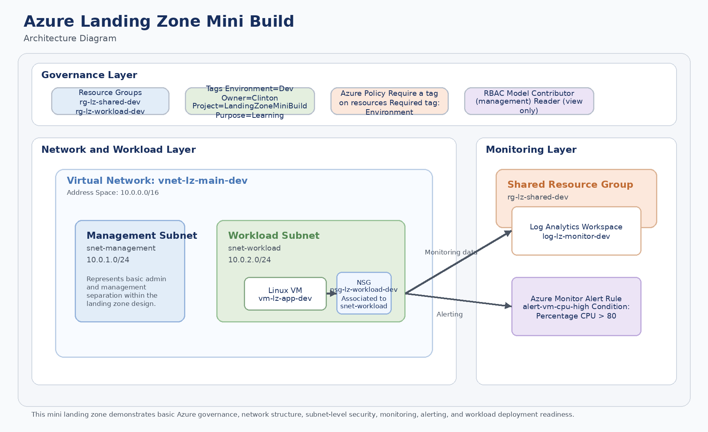

## Resource Naming

The following naming convention is used:

`[resource-type]-[project]-[purpose]-[environment]`

Examples:

- `rg-lz-shared-dev`
- `rg-lz-workload-dev`
- `vnet-lz-main-dev`
- `nsg-lz-workload-dev`
- `log-lz-monitor`
- `vm-lz-app-dev`

## Tagging Strategy

The following tags are applied to the resource groups as part of the governance model:

- `environment = dev`
- `owner = Clinton`
- `project = LandingZoneMiniBuild`
- `purpose = learning`

## Governance Model

Azure Policy is used to strengthen tag governance across the environment.

The policy model includes:

- **Require a tag on resource groups** for `environment`
- **Require a tag on resource groups** for `project`
- **Inherit a tag from the resource group if missing** for `environment`
- **Inherit a tag from the resource group if missing** for `project`
- **Require a tag on resources** for `environment`
- **Require a tag on resources** for `project`

This approach ensures that required tags are enforced on resource groups, inherited by resources where missing, and validated across the environment.

## Deployment Steps

The project is implemented in the following order:

1. Create separate resource groups for shared and workload resources
2. Apply required tags to both resource groups
3. Create a Log Analytics workspace for monitoring
4. Create a virtual network with management and workload subnets
5. Create a Network Security Group and associate it with the workload subnet
6. Implement Azure Policy for tag governance
7. Review and document the RBAC access model
8. Create and configure a Linux virtual machine in the workload subnet
9. Configure recommended alerts and an action group for the virtual machine
10. Enable log-based monitoring for the virtual machine using the existing Log Analytics workspace
11. Perform final validation of the environment

## Key Configuration Details

- **Region:** `South Africa North`
- **Environment:** `dev`
- **Virtual Network Address Space:** `10.0.0.0/16`
- **Management Subnet:** `10.0.1.0/24`
- **Workload Subnet:** `10.0.2.0/24`
- **Policy Scope:** `Subscription`
- **Required Policy Tags:** `environment`, `project`
- **Log Analytics Workspace:** `log-lz-monitor`
- **VM Name:** `vm-lz-app-dev`
- **Boot Diagnostics:** `Enable with managed storage account (recommended)`
- **Auto-shutdown:** `Enabled with email notification`
- **Monitoring Type:** `Log-based (Classic)`
- **Alert Rules Enabled:**
  - `Percentage CPU > 80`
  - `Available Memory Bytes < 1`
  - `VmAvailabilityMetric < 1`
- **Notification Method:** `Email`
- **Action Group:** `Created and linked to the recommended alert rules`

## Monitoring and Alerting Baseline

The virtual machine includes a basic monitoring and alerting baseline.

### Monitoring

Enhanced VM monitoring is enabled using the **logs-based (classic)** monitoring path with the existing Log Analytics workspace `log-lz-monitor`.

This approach is used instead of the default metrics-based path so monitoring can be enabled using existing tagged resources in a policy-controlled environment.

### Recommended Alerts

The following recommended alert rules are enabled for the VM:

- **Percentage CPU** greater than `80`
- **Available Memory Bytes** less than `1`
- **VmAvailabilityMetric** less than `1`

The following recommended alert rules are left disabled:

- **Data Disk IOPS Consumed Percentage** greater than `95`
- **OS Disk IOPS Consumed Percentage** greater than `95`
- **Network In Total** greater than `500`
- **Network Out Total** greater than `200`

### Action Group

An email-based action group is created and linked to the recommended alert rules so notifications are sent when alert conditions are met.

## Validation Performed

The following checks are completed to validate the landing zone:

- confirm both resource groups are created successfully
- confirm required tags are applied to the resource groups
- confirm the Log Analytics workspace is deployed in the shared resource group
- confirm the virtual network and both subnets are created with the planned address ranges
- confirm the NSG is associated with the workload subnet
- confirm Azure Policy assignments for `environment` and `project` exist at the subscription scope
- confirm the Linux virtual machine is deployed into the workload subnet
- confirm Boot diagnostics is enabled on the VM
- confirm Auto-shutdown is enabled on the VM
- confirm log-based monitoring is enabled using `log-lz-monitor`
- confirm the recommended alert rules are created successfully
- confirm the action group is linked to the alert rules

## Screenshots

### Resource Groups

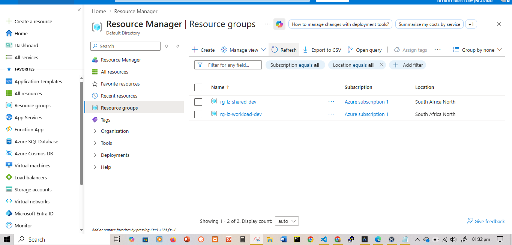

### Tags Applied

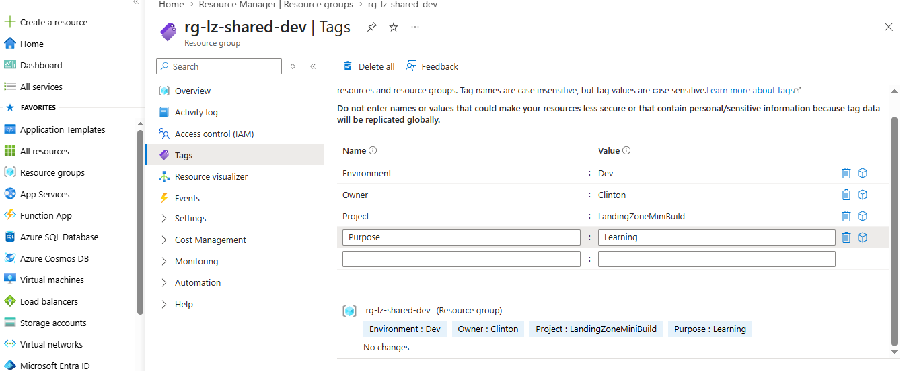

### Log Analytics Workspace

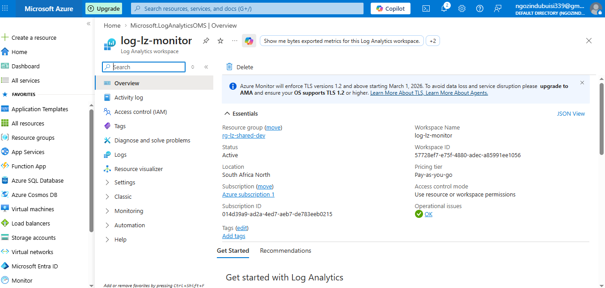

### Virtual Network and Subnets

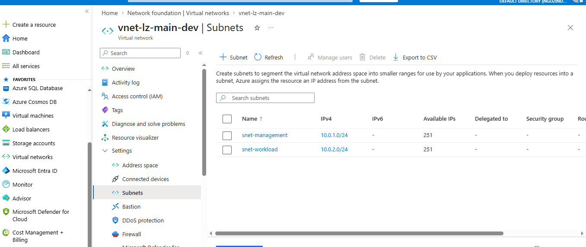

### NSG Association

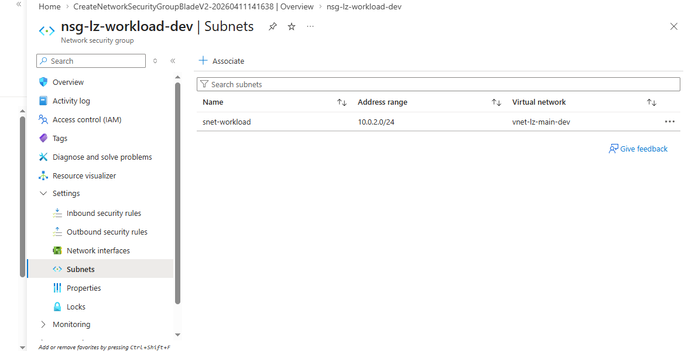

### Azure Policy Assignments

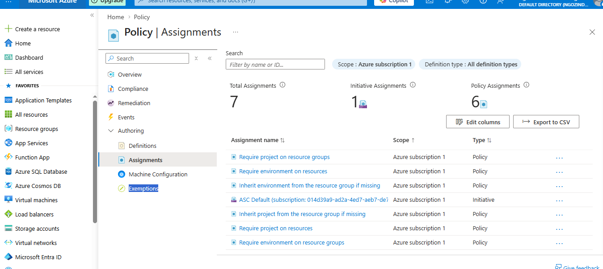

### Azure Policy Remediation

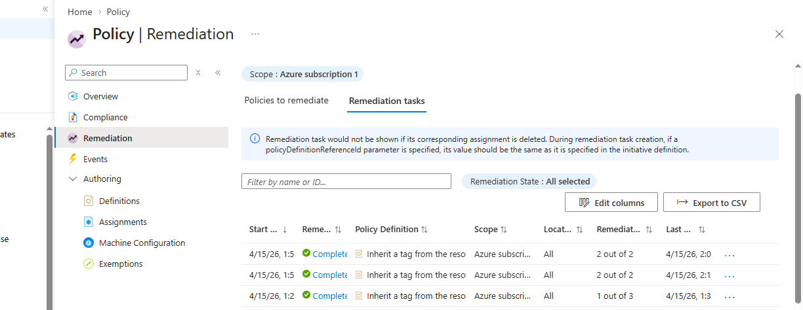

### RBAC Review

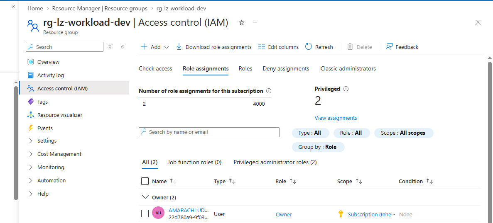

### Linux VM Overview

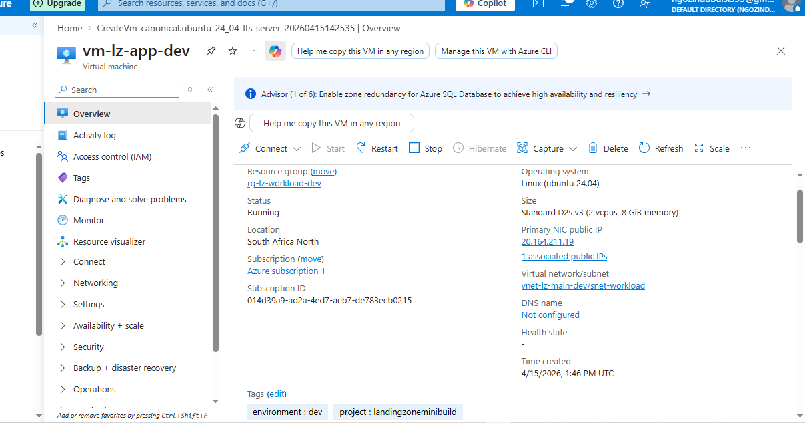

### Recommended VM Alerts

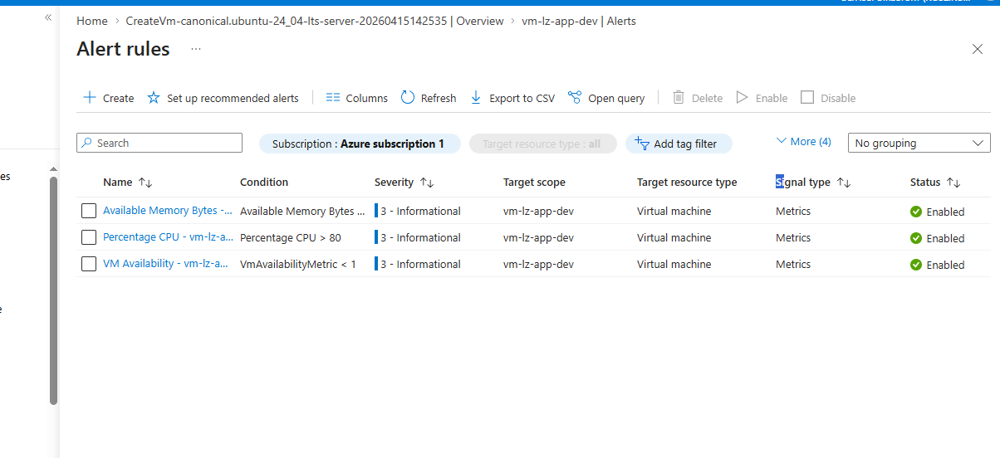

### VM Monitoring Enabled

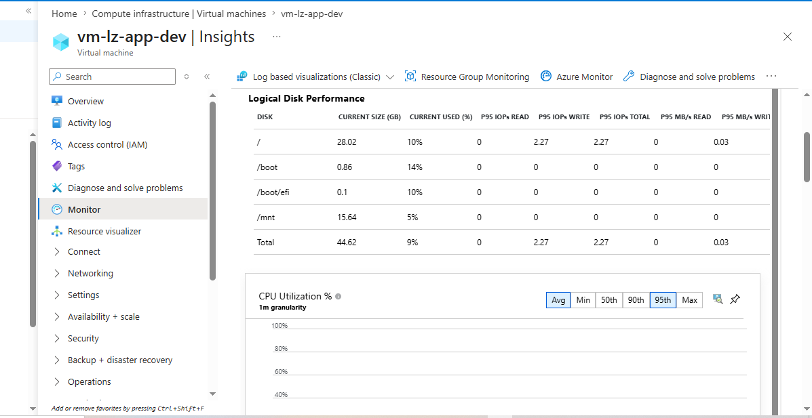

### Final Validation

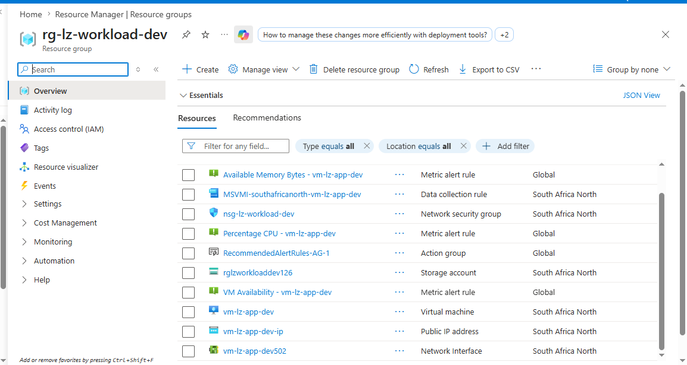
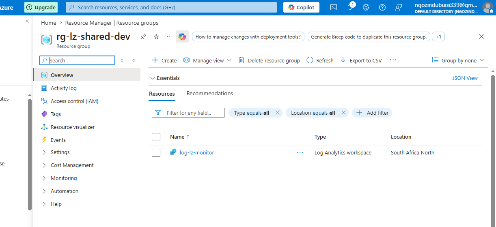

## Project Outcome

This project results in a small but structured Azure landing zone that includes governance, network organisation, subnet-level security, monitoring, alerting, and a deployed Linux virtual machine. It shows how Azure resources can be prepared in a more controlled and operationally aware way before hosting workloads.

## Lessons Learned

Through this project, I strengthen my understanding of:

- how to separate shared and workload resources in Azure
- how tags support organisation and governance
- how Azure Policy can enforce and inherit tags across an environment
- how subnet-level NSG association supports network security
- how boot diagnostics and auto-shutdown improve VM management
- how recommended alerts and action groups provide an operational baseline
- how Log Analytics supports VM monitoring and visibility
- how to validate an Azure environment after deployment

## Next Improvements

Future improvements to this project could include:

- rebuilding the environment with Bicep
- packaging governance controls into an initiative
- strengthening RBAC with test identities and least-privilege assignments
- adding private endpoints or more advanced network controls
- expanding monitoring with additional guest log collection
- adding budgets or cost management controls
- extending the environment with additional workloads
